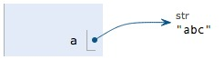
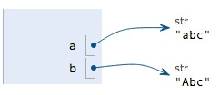

# Python常用函数总结
## Python enumerate()函数
enumerate() 函数用于将一个可遍历的数据对象(如列表、元组或字符串)组合为一个索引序列，同时列出数据和数据下标，一般用在 for 循环当中。
>示例：
```python
seq = ['one', 'two', 'three']
for i, element in enumerate(seq): 
       print i, element
0 one

1 two
2 three
```
## Python eval()函数
eval() 函数用来执行一个字符串表达式，并返回表达式的值。
```python
eval(expression[, globals[, locals]])
```
### **参数：**
expression -- 表达式。
globals -- 变量作用域，全局命名空间，如果被提供，则必须是一个字典对象。

locals -- 变量作用域，局部命名空间，如果被提供，可以是任何映射对象。
>示例：
```python
1、简单表达式
    print(eval('1+2'))    输出结果：3
2、字符串转字典
    print(eval("{'name':'linux','age':18}")    输出结果：{'name':'linux','age':18}
 3、传递全局变量
    print(eval("{'name':'linux','age':age}",{"age":1822}))    输出结果：{'name': 'linux', 'age': 1822}
4、传递本地变量
    age=18
    print(eval("{'name':'linux','age':age}",{"age":1822},locals()))    输出结果：{'name': 'linux', 'age': 18}
```

## Python sorted()函数
sorted() 函数对所有可迭代的对象进行排序操作，返回的是个列表。

sort 与 sorted 区别：sort 是应用在 list 上的方法，sorted 可以对所有可迭代的对象进行排序操作。

list 的 sort 方法返回的是对已经存在的列表进行操作，而内建函数 sorted 方法返回的是一个新的 list，而不是在原来的基础上进行的操作。
### sorted 语法：
```python
sorted(iterable, key=None, reverse=False)
```
### 参数：
### iterable -- 可迭代对象。
key -- 主要是用来进行比较的元素，只有一个参数，具体的函数的参数就是取自于可迭代对象中，指定可迭代对象中的一个元素来进行排序。

reverse -- 排序规则，reverse = True 降序 ， reverse = False 升序（默认）。
>示例：
```python
sorted({1: 'D', 2: 'B', 3: 'B', 4: 'E', 5: 'A’})
>>>[1, 2, 3, 4, 5]
```
#### 利用key进行倒序排序
```python
example_list = [5, 0, 6, 1, 2, 7, 3, 4]
result_list = sorted(example_list, key=lambda x: x*-1)
print(result_list)
[7, 6, 5, 4, 3, 2, 1, 0]
```
#### 要进行反向排序，也通过传入第三个参数 reverse=True：
```python
example_list = [5, 0, 6, 1, 2, 7, 3, 4]
sorted(example_list, reverse=True)
[7, 6, 5, 4, 3, 2, 1, 0]
```
#### 字典排序
```python
ans_list = sorted(dict.items(), key=lambda x: int(x[1][1]), reverse=True)
dic = {'a':3 , 'b':2 , 'c': 1}
sorted(dic.iteritems, key = lambda x:x[0], reverse = True)
[(‘c’,1),(‘b’,2),(‘a’,3)] #按键降序
sorted(dic.iteritems, key = lambda x:x[1], reverse = False)
[(‘c’,1),(‘b’,2),(‘a’,3)] #按值升序
a_dic = {'a':{'val':3}, 'b':{'val':4}, 'c':{'val':1}}
dict = sorted(a_dic.iteritems(), key=lambda d:d[1]['val'], reverse = True)
dict
>>>[('b', {'val': 4}), ('a', {'val': 3}), ('c', {'val': 1})]
```
## Python lambda()函数
- ### lambda
- ### 功能: 创建匿名函数
- ### 区别: 和def函数定义,以下两点区别
   #### lambda会创建一个函数对象，但不会把这个函数对象赋给一个标识符;而def则会把函数对象赋值给一个变量
   #### lambda它只是一个表达式，而def则是一个语句
>示例：
```python
>>> func = lambda x:x+2
>>>print(func(3))
5
>>> func = lambda x,y : x+y
>>>print(func(3,4))
7
```
## Python 正则表达式
## Python 字典
- ### python无序字典 
在Python中直接默认的是无序字典，这种不会按照你插入的顺序排序，即使你对字典排序后，返回的也是一个list变量，而不是字典，倘若你将这个list字典后，又会变回无序字典。
```python
import operator
x = {"label": "haha", "data": 234, "score": 0.3}
sorted_x = sorted(x.items(), key=operator.itemgetter(0))
print x
print type(x)
print sorted_x
print type(sorted_x)
print dict(sorted_x)

{'label': 'haha', 'data': 234, 'score': 0.3}
<class 'dict'>
[('data', 234), ('label', 'haha'), ('score', 0.3)]
<class 'list'>
{'data': 234, 'label': 'haha', 'score': 0.3}
```
- ### python 有序字典
如果我们想保持字典按照我们插入的顺序有序怎么办？可以用OrderedDict来初始化字典。
```python
from collections import OrderedDict 
x = OrderedDict() 
x["label"] = "haha"
x["data"] = 234
x["score"] = 0.3 
print x 
print type(x)
OrderedDict([('label', 'haha'), ('data', 234), ('score', 0.3)])
<class 'collections.OrderedDict’>
```

- ### Python 一键多值字典
如果我们想用一键多值字典怎么办，可以使用defaultdict，例子如下：
```python
from collections import defaultdict

video = defaultdict(list)
video["label"].append("haha")
video["data"].append(234)
video["score"].append(0.3)
video["label"].append("xixi")
video["data"].append(123)
video["score"].append(0.7)

print video
print type(video)

defaultdict(<class 'list'>, {'label': ['haha', 'xixi'], 'data': [234, 123], 'score': [0.3, 0.7]})
<class 'collections.defaultdict’>
```

- ### Python列表生成式
初级
```python
b = range(1, 11)
c = [x*x for x in b]
print(c)
# 结果：[1, 4, 9, 16, 25, 36, 49, 64, 81, 100]
```
带if判断
```python
# 提取大于0的数
c = [1, 3, -3, 4, -2, 8, -7, 6] 
d = [x for x in c if x > 0] 
print(d) 
```
多参数生成
```python
a = [1, 2, 3, 4, 5] 
b = ["a", "b", "c", "d", "e"] 
# 多个参数列表生成式
c = [str(x)+str(y) for x, y in zip(b, a)] 
print(c) 
# 结果：['a1', 'b2', 'c3', 'd4', 'e5’]
```
- ### 生成器
通过列表生成式，我们可以直接创建一个列表。但是，受到内存限制，列表容量肯定是有限的。而且，创建一个包含100万个元素的列表，不仅占用很大的存储空间，如果我们仅仅需要访问前面几个元素，那后面绝大多数元素占用的空间都白白浪费了。这个其实是惰性求值，数据不是全部一下子载入到内存中，而是一个一个来。
```python
g = (i for i in range(10))
print(g)
# 把列表推导的圆括号换成方括号就变成了一个生成器
# <generator object <genexpr> at 0x000001AA11DD3D68>
```
## Python高级语法：生成器、迭代器、装饰器、闭包、运算符重载
[链接1](https://www.cnblogs.com/owenqing/p/10449571.html)

[链接2](https://www.cnblogs.com/BlueMountain-HaggenDazs/p/6354183.html)

[链接3](https://www.cnblogs.com/yidashi110/p/10464995.html)

## Python再议不可变对象
对于可变对象list，对list进行操作的时候,list内部的内容会发送变化：
```python
>>> a = ['c', 'b', 'a']
>>> a.sort()
>>> a
['a', 'b', 'c’]
```
但是不可变对象，对于str，来说是不会变化的：
```python
>>> a = 'abc'
>>> a.replace('a', 'A')
'Abc'
>>> a
‘abc’
```
为了方便理解，改变代码如下：
```python
>>> a = 'abc'
>>> b = a.replace('a', 'A')
>>> b
'Abc'
>>> a
'abc'
```
 要始终牢记的是，a是变量，而'abc'才是字符串对象！有些时候，我们经常说，对象a的内容是'abc'，但其实是指，a本身是一个变量，它指向的对象的内容才是'abc’：



当我们调用a.replace('a', 'A')时，实际上调用方法replace是作用在字符串对象'abc'上的，而这个方法虽然名字叫replace，但却没有改变字符串'abc'的内容。相反，replace方法创建了一个新字符串'Abc'并返回，如果我们用变量b指向该新字符串，就容易理解了，变量a仍指向原有的字符串'abc'，但变量b却指向新字符串'Abc’了：



所以，对于不变对象来说，调用对象自身的任意方法，也不会改变该对象自身的内容。相反，这些方法会创建新的对象并返回，这样，就保证了不可变对象本身永远是不可变的。

zhangli
3
